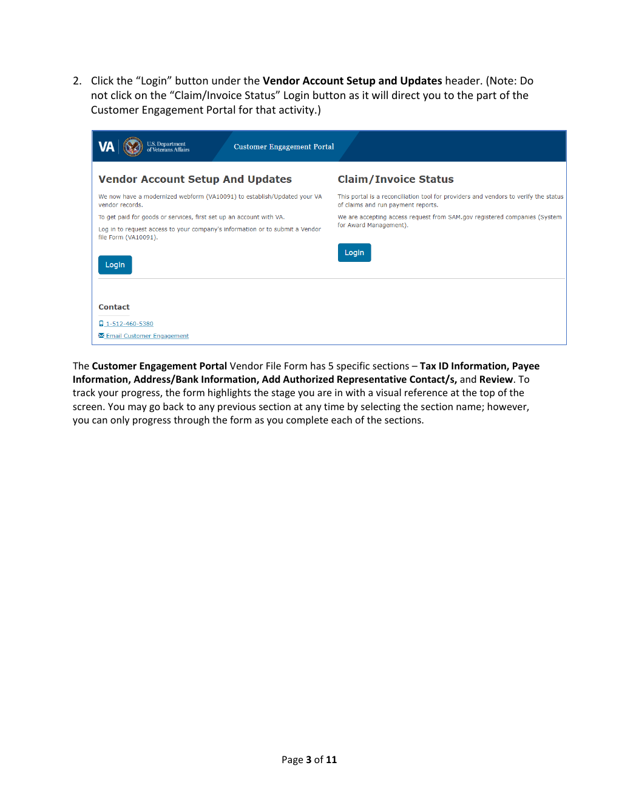

# English Screenshot Guide Demo: VA Customer Engagement Portal Login

This demo shows two pages from a public U.S. Department of Veterans Affairs
walkthrough for the Customer Engagement Portal, processed with the accurate
profile. The pages mix prose with UI screenshots (an "Authorized Use Only"
dialog, the portal landing page); the pipeline initially misread the
screenshot-heavy layout as a fillable form, and the reviewer repair step
rebuilt it into a clean step-by-step guide.

## Source Pages

## Generated Output

- [raw-parse.md](raw-parse.md): the parse-only baseline — screenshots are dead image links, an OCR typo ("AAuthorized") became a heading, and steps got promoted to section titles.
- [output.md](output.md): the main document, restructured by the reviewer into overview, prerequisites, numbered steps with warnings, and the form-section outline.
- [figure-example.md](figure-example.md): a split figure document — the portal landing page screenshot as semantic facts plus a scene description.
- [chunks.jsonl](chunks.jsonl): retrieval chunks generated from the semantic output.
- [quality_gate.json](quality_gate.json): pass status (score 0.95) with one honest warning about a merged OCR label in the intermediate records.

## What to Look For

- Compare [raw-parse.md](raw-parse.md) with [output.md](output.md): the baseline loses everything inside the screenshots and keeps OCR damage; the semantic output is a clean guide plus grounded figure documents.
- The "I Agree" step and the warning about the wrong "Claim/Invoice Status" Login button both survive as explicit, retrievable instructions.
- The Authorized Use Only legal notice is captured as a structured quote block instead of a wall of screenshot OCR.
- A decorative warning-triangle icon from the dialog was filtered out; the meaningful screenshots each became a figure document.

## Model Note

This snapshot was generated in the test environment with local Ollama model
`qwen3.6:35b-a3b-q8_0` as the enrichment/reviewer model. Stronger compatible
vision or reviewer models may improve visual reasoning and semantic quality.

## Run Metadata

- Run ID: `01KXQEWENMGXYS7ECBYTM5HR6G`
- Document ID: `52d9b041d27a47e0`
- Profile: `accurate`
- Output language: `en`
- Quality gate: `pass` (0.95)

## Source Attribution

The source pages are pages 2–3 of the VA Financial Services Center
"Customer Engagement Portal Vendor Webform User Guide":
<https://www.va.gov/COMMUNITYCARE/docs/providers/Vendor-WebForm-UserGuide.pdf>

## Notes

The contact phone number visible in the screenshot is the VA's published
public support line. The output is intended to show the RAG-ready shape of
screenshot-based documents, not to replace the official VA instructions.
