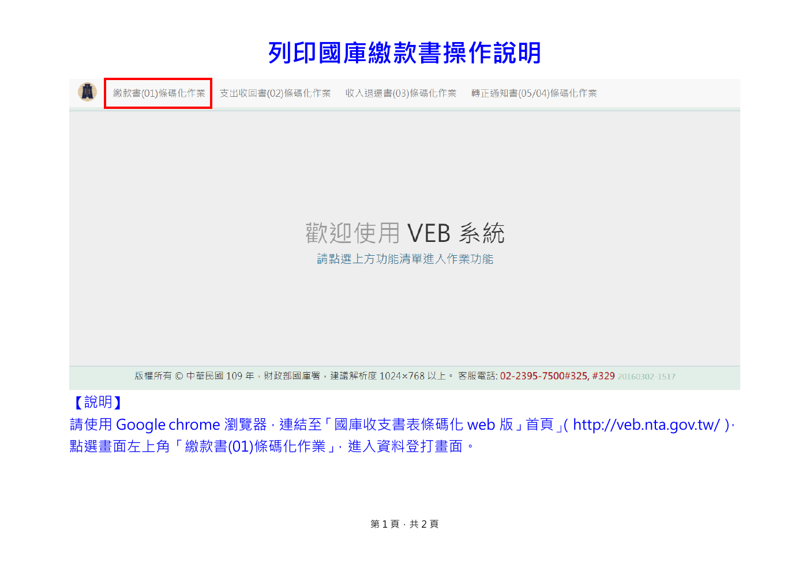
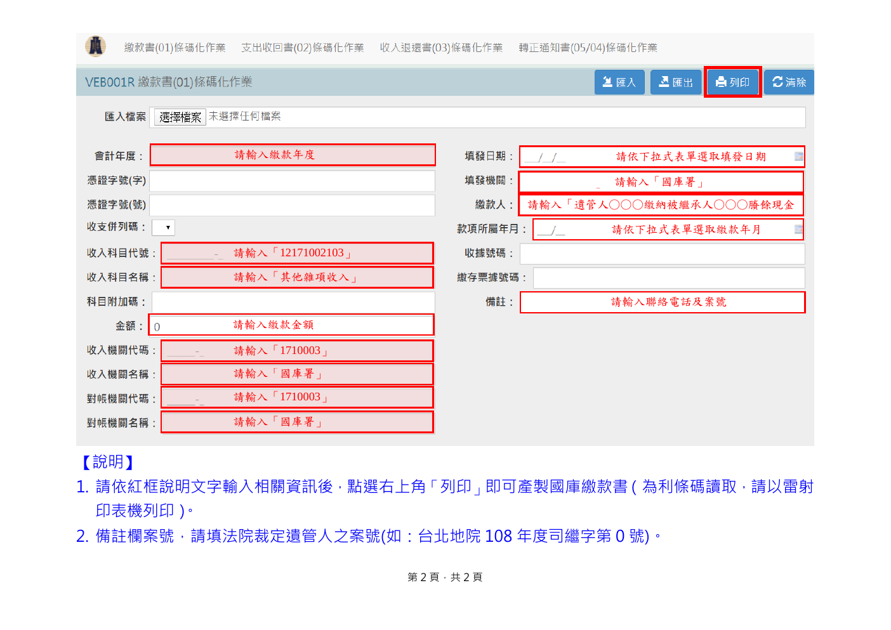

# Traditional Chinese Screenshot Guide Demo: Treasury Payment Slip Printing

This demo shows a two-page Traditional Chinese how-to guide built almost
entirely from UI screenshots, processed with the accurate profile. The
screenshots (menu bars, red-box highlights, a data-entry form with field
hints) are converted into semantic descriptions and retrievable text instead
of staying invisible images.

## Source Pages

## Generated Output

- [raw-parse.md](raw-parse.md): the parse-only baseline — the complete raw output of the parsing/OCR layer, where both screenshots are dead image links.
- [output.md](output.md): the main document — what the viewer shows and what 主文 downloads deliver.
- [figure-example.md](figure-example.md): one of the split figure documents — the form-screen screenshot rendered as semantic facts plus a scene description.
- [chunks.jsonl](chunks.jsonl): retrieval chunks generated from the semantic output.
- [quality_gate.json](quality_gate.json): pass status (score 1.0) with no open issues.

## What to Look For

- Compare [raw-parse.md](raw-parse.md) with [output.md](output.md): in the baseline the whole data-entry screen is one image link; in the semantic output every field hint is retrievable text.
- The red-box callout on page 1 (「繳款書(01)條碼化作業」選項被紅框特別標示) survives as text a retriever can find.
- Every field hint on the form screenshot (收入科目代號 「12171002103」, 機關代號 「1710003」…) is transcribed once and also restated as grounded semantic facts.
- The document title is recovered from the page (列印國庫繳款書操作說明), not from a generic section label or the file name.

## Model Note

This snapshot was generated in the test environment with local Ollama model
`qwen3.6:35b-a3b-q8_0` as the enrichment/reviewer model. Stronger compatible
vision or reviewer models may improve visual reasoning and semantic quality.

## Run Metadata

- Run ID: `01KXQEWEJTXCRG7SDNM2H5RN6C`
- Document ID: `028e33ae775f8034`
- Profile: `accurate`
- Output language: `zh-TW`
- Quality gate: `pass` (1.0)

## Source Attribution

The source pages are from the National Treasury Administration (Ministry of
Finance, Taiwan) operation guide for printing treasury payment slips in the
public VEB system (國庫收支應用書表條碼化 Web 版):

- System: <https://veb.nta.gov.tw/>
- Agency information page: <https://www.nta.gov.tw/singlehtml/241?cntId=8ab3b311519146c7bd4126f8a72fc260>

## Notes

The guide teaches a public government workflow; the phone numbers and field
example values shown are the agency's published, non-personal instructions.
The output is intended to show the RAG-ready shape of screenshot-based
documents, not to replace the official instructions.
